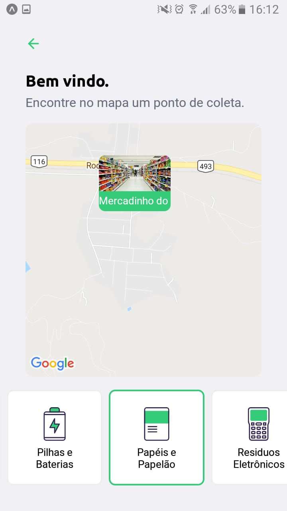
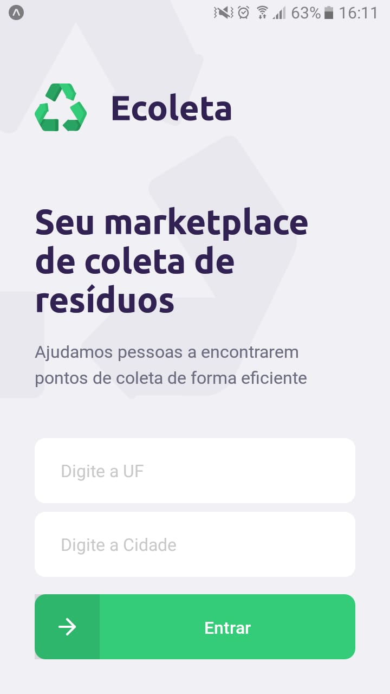

# Mobile E-Coleta

<p align="center">


</p>

## Description
This is a project in [React Native](https://reactnative.dev/) and [Expo](https://expo.io/) and was made based on the [Rocketseat](https://rocketseat.com.br/) videos;

This project has a view in `ReatJs` that is available at this [repo](https://github.com/ademarCardoso/front-ecoleta), and the back-end that serves these applications is [here](https://github.com/ademarCardoso/back-ecoleta).

## How to run
To run this project, first clone this repository:
```bash
git clone https://github.com/ademarCardoso/mobile-ecoleta.git
```
Install all dependecies: 
```bash
npm install
```
Remembering that, to view this project, you need a cell phone or some `Android` or `IOS` emulator, to use the cell phone, just scan the **QRCode** that will be generated, remembering that the cell phone and the computer must be on the same network, and to run on an android or IOS emulator, you must have the environments of each SKD pre-configured. 
[Rocketset ](https://docs.rocketseat.dev/) has great documentation on how to set up development environments.

With everything set up, run the command below and test the app:

```bash
npm run start
```